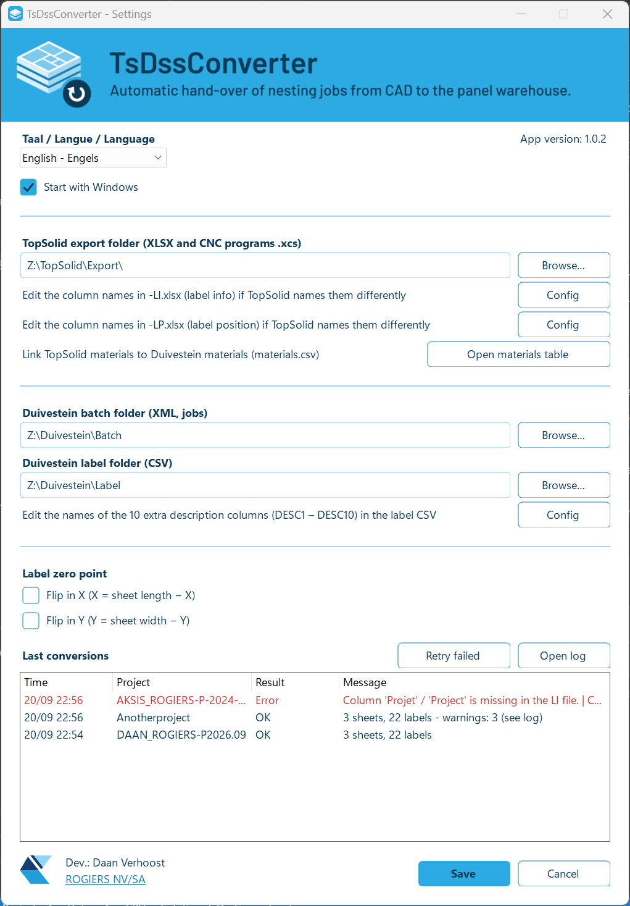
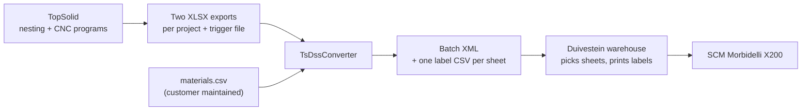

<h1 align="center"></h1>

**Automatic hand-over of nesting jobs from TopSolid to the Duivestein warehouse.**

TsDssConverter is a small Windows tray application that watches a folder for TopSolid nesting exports and
converts them, without any manual work, into a job that the Duivestein automatic warehouse understands.

> **Status: under development.** The conversion engine, its input checks, a command line tool, the tray application
> and the automatic folder watching are finished and tested (stages 1 to 4 of 5), and the delivery file for version
> 1.0.3 exists (stage 5). The test at the customer and with the real machines is still to come.
> See [Status and roadmap](#status-and-roadmap).
>
> **Important fix still to do:** TopSolid must put the project name in front of the file name of every CNC program, so that
> two jobs can never overwrite each other's programs. See [Important fix still to do](#important-fix-still-to-do).

---

## What it looks like

The program lives in the Windows tray, next to the clock (possibly under the `^` arrow), and always works silently in the
background. Double-click the icon to open the window to modify settings if needed.

<p align="center">
  
</p>

The settings window (here in English; the whole interface is also available in Dutch and French) holds the folders,
the label zero point and the list of the last conversions:

<p align="center">
  
</p>

<p align="center">
  
</p>

## Why this tool exists

At the customer, panels are nested and programmed in **TopSolid** (CAD/CAM) for an **SCM Morbidelli X200**
CNC machine. The boards are stored and handled by a **Duivestein automatic warehouse**, which:

1. picks each sheet and puts it onto the label table,
2. prints and places the labels (the label template layout is generated by Duivestein),
3. registers the CNC program on the SCM and pushes the sheet onto the machine.

The warehouse needs a *batch job* in XML-format that describes which sheets to pick, which labels to print and where each
label goes. **TopSolid does not produce that format. TsDssConverter is the missing link between the two systems.**


## What it does

For every finished TopSolid project it:

- reads the TopSolid XLSX exports (label information '-LI' and label positions '-LP') and joins them per part,
- translates the TopSolid material names to the warehouse material names,
- creates **one batch XML** with one plan per material and one entry per sheet (label file + CNC program),
- creates **one label CSV per sheet**, with a row per part: its position, rotation, dimensions, edge banding
  and other data that Duivestein can use in the label layout,
- puts the files in the folders that the Duivestein warehouse reads.

Excel or Office is **not** needed on the PC.

**What it does not do:** it does not print labels, does not talk to the machine and does not talk to
TopSolid. It only reads and writes files.

### Example

The included sample project (22 parts) becomes:

- 1 batch XML with 2 plans (one per material), and
- 3 label files, one for each physical sheet.

An extract of the batch XML:

```xml
<Plan>
  <PlanName>001</PlanName>
  <MaterialName>Melamine_18</MaterialName>
  <XDimSize>2850</XDimSize>
  <YDimSize>2100</YDimSize>
  <Quantity>2</Quantity>
  <LabelFilenames>
    <LabelFilename>Z:\Duivestein\Label\DAAN_ROGIERS-P2026.09_001.csv</LabelFilename>
    <!-- ... one per sheet ... -->
  </LabelFilenames>
  <CNCFilenames>
    <CNCFilename>Z:\TopSolid\Export\CNC\DAAN_ROGIERS-P2026.09\Melamine_18#01.xcs</CNCFilename>
    <!-- ... same order as the label files ... -->
  </CNCFilenames>
</Plan>
```

The complete expected output is in [`samples/duivestein/`](samples/duivestein/).

## Built to be safe

A wrong job means a wrong board on the machine, so the tool is strict:

- **Never guesses a material.** A material missing from `materials.csv` stops the conversion and is named in the message.
- **Never overwrites a job.** If the batch already exists in the warehouse folder, nothing is written. This means that
- **Jobs cannot overwrite each other's CNC programs.** TopSolid names them after the sheet only, so each job's programs are moved
  to `CNC\<project>\` after conversion, and a program newer than the job's trigger file is refused. This is a safety net; the
  real cure is still to be done in TopSolid (see [Important fix still to do](#important-fix-still-to-do)).
- **The warehouse never sees half a job.** Label files first, batch XML last; every file is renamed into place when complete.
- **Bad input is refused, not repaired.** Missing columns, unmatched or duplicate parts, unknown materials, unreadable
  dimensions and labels outside their sheet are errors; nothing is written.
- **Every problem is reported at once,** in plain language (Dutch, French or English), naming the part or column. Non-blocking
  issues (a CNC program not there yet, a duplicate part number) are warnings only.
- **Independent of regional settings.** Numbers are read and written the same way on every PC.

## How the automatic processing works

The program watches the TopSolid export folder. TopSolid writes the two data files (`-LI` and `-LP`) and the CNC
programs, and the trigger file (`-TR`) as the very last one. When the trigger file appears:

1. The program waits until the three files are complete and no longer in use (it checks every 2 seconds, and gives up
   with an error after 2 minutes).
2. It converts the project (one at a time) and writes the label files and the batch XML for the warehouse.
3. It moves the three files to `_Verwerkt\<date-time> <project>` in the export folder (`_Effectuee` / `_Converted` in French /
   English, the folder names follow the selected language), and the CNC programs of the job
   to `CNC\<project>\` (the batch XML points there). The export folder itself then only holds what is not converted yet.
4. If something is wrong with the files, they go to `_Fout\<date-time> <project>` (`_Erreur` / `_Error`) together with a `fout.txt` that
   explains in plain language (in the selected language) what to correct. After the cause is fixed (for example a
   material was added to `materials.csv`), the button **Herstart mislukte** / **Réessayez échoué** / **Retry failed** in the
   settings window puts the files of all failed projects back in the export folder, which starts a new attempt at once.
   It never overwrites a file that is already in the export folder (for example a newer export of the same project): such
   a project is left alone and the user is told. Putting the files back by hand works as well.

Problems that are not the fault of the files, such as a network drive that is not connected yet, do **not** move
anything: the files wait and the program tries again by itself, and the user is told once. The program also scans the
folder every 30 seconds (in case a file event is missed), and the menu item *Nu scannen* scans at once.

## Status and roadmap

| Stage | Content | Status |
|---|---|---|
| 1 | **Core + command line tool**: read, join, map, write XML and CSVs; automated tests | **Done (first draft)** |
| 2 | **Validation**: all checks and warnings, one clear report, exit code for errors | **Done (first draft)** |
| 3 | **Tray application (shell)**: icon with four looks (normal, busy, error, paused), menu, settings window, `settings.json`, start with Windows, log files. No conversion yet | **Done (first draft)** |
| 4 | **Folder watching and processing**: trigger file, one conversion at a time, `_Verwerkt` / `_Fout` folders with a readable `fout.txt`, notifications, recovery when the network drive is gone | **Done (first draft)** |
| 5 | **Delivery**: one file `TsDssConverter.exe` (version 1.0.3, 52 MB, no .NET needed), install at the customer, physical test sheet | **File built, customer test next** |

**What is verified so far**

- 406 automated tests pass. They cover the conversion, every error and warning, the settings window, the folder watching (with a
  fake clock) and all three languages.
- The sample TopSolid export converts to exactly the expected files (compared byte for byte).
- The single-file `.exe` (about 52 MB) starts, creates its files and refuses a second copy. An earlier build ran on a PC without
  .NET and converted the sample correctly.
- A renamed TopSolid column can be followed by editing a text file (the *Config* buttons); this is tested too.

**What is *not* verified yet**

- The batch XML was tried in Duivestein's DSSClient on 2026-09-21: it was **almost correct**, and the syntax was corrected
  (see the CHANGELOG). The program now writes the corrected syntax; a full run with the label files on the machine is still to
  come, and the label CSVs are not confirmed by Duivestein yet.
- Nothing has been tested with the customer's own TopSolid export or on the machine.
- The label position and rotation still have to be checked with a physical test sheet.

## Decisions taken so far

- **One folder:** everything lives in `C:\TsDssConverter\` (exe, settings, `materials.csv`, column files, logs). Uninstalling means
  deleting it.
- **Editable column names:** the header names the program looks for are in small text files (the *Config* buttons), so a renamed
  TopSolid column does not break it.
- **Three languages:** Dutch (default), French and English, chosen in the settings. Files for the warehouse are not translated.
- **Quiet operation:** in the tray, no pop-ups on success; on an error one notification and a red icon until the next success or
  until the window is opened.
- **Retry failed:** one button puts all failed projects back in the export folder once the cause is fixed. It never overwrites and
  is silent on success.
- **TopSolid files:** `-TR` is written last, so everything else is complete when it appears. CNC programs are `.xcs`, with
  drive-letter paths (`Z:`) in the batch XML.
- **CNC programs are moved** after conversion to `Z:\TopSolid\Export\CNC\<project>\`, so jobs never overwrite each other's programs.
- **Materials:** the TopSolid name is the master name; the warehouse uses the same names and checks the sheet sizes against its stock.
- **By design:** the list of conversions is not saved between runs, and the app runs only while a user is logged in.

## Important fix still to do

**Every CNC program file must get the project name as a prefix, to be set up in TopSolid** (for example
`DAAN_ROGIERS-P2026.09_Melamine_18#01.xcs` instead of `Melamine_18#01.xcs`; the exact format is to be agreed with TopSolid).

Why this matters: TopSolid writes the programs of **all** jobs in one shared folder and names them after the sheet only. A
second job with the same material and sheet number overwrites the program of the first job before the first job has been
converted, and a wrong program on the machine is the most expensive mistake this tool could allow.

What the converter does today (a workaround, not a cure): after a conversion it moves the programs of the job to their own
folder, `CNC\<project>\`, and it refuses a program that is more than 5 seconds newer than the job's trigger file. That
check compares file times on a network drive, so it is a good safety net but it cannot be proven complete (for example two
exports within a few seconds of each other, or clocks that differ between the PCs).

With the project name in the file name the collision **cannot happen at all**. When TopSolid delivers it, the change in this
program is small and in one place (`CncPathBuilder`: the name it looks for and writes in the batch XML), and the "newer than
the trigger file" check can then be dropped.

## Still to be confirmed by others

| From | Question |
|---|---|
| TopSolid | **Important:** put the project name in front of the CNC file name (see [Important fix still to do](#important-fix-still-to-do)). Also confirm the naming and folder of the CNC program per sheet. Until then the program assumes `{sheet name}.xcs` in the export folder (for example `Melamine_18#01.xcs`), which is how all the exports we have look |
| TopSolid | The sheet thickness column in the export is always 18; fix in the export (the tool takes the thickness from `materials.csv`) |
| Duivestein | Restrictions on batch name (length, characters) and what happens when a batch is sent twice |
| Duivestein | Character encoding for accented characters in the label files (UTF-8 is used for now) |
| Physical test | Which point of the label the position refers to, the rotation direction, and whether the zero-point settings change the rotation |

## Project layout

```
samples/
  topsolid/       Example TopSolid export (input)
  duivestein/     Expected output for the example + the format description from Duivestein
  materials.sample.csv
src/
  TsDssConverter.Core/   All conversion logic (no Windows or user interface dependencies)
  TsDssConverter.Cli/    Command line tool for manual testing
  TsDssConverter.Tray/   The tray application (Windows Forms): icon, menu, settings window
tests/
  TsDssConverter.Tests/  Automated tests, using the files in samples/
media/                   Application icon, banner and the colour theme used by the whole project
docs/                    Background documentation
publish.cmd              Builds the delivery file (runs the tests, then makes dist\v<version>\TsDssConverter.exe)
```

## Technology

C# on .NET 10, [ClosedXML](https://github.com/ClosedXML/ClosedXML) to read XLSX files (no Excel needed),
xUnit for the tests. The tray application uses Windows Forms.

## Credits

Developed by Daan Verhoost for [ROGIERS NV/SA](https://www.rogiers.be/).
