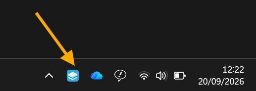
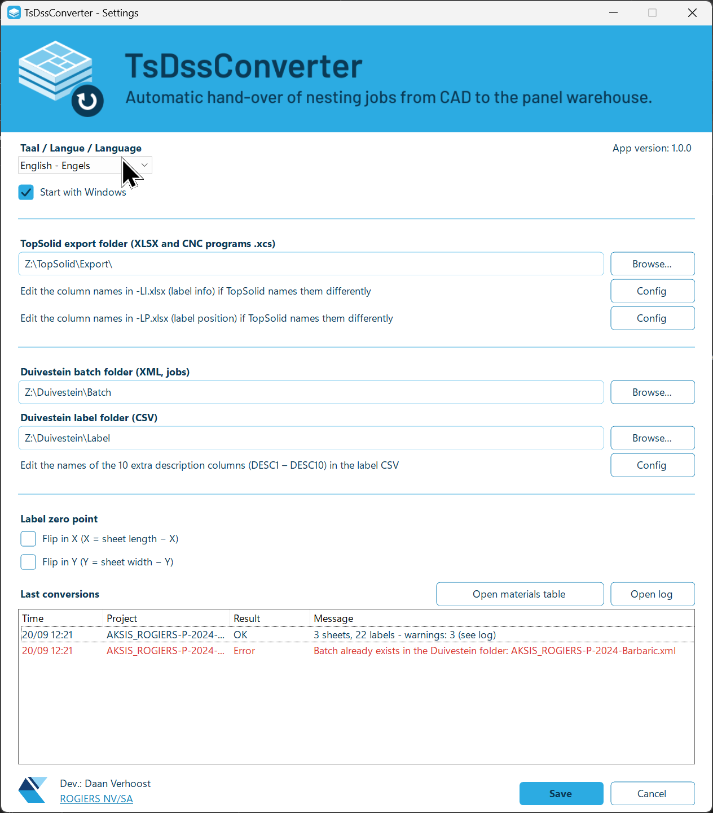
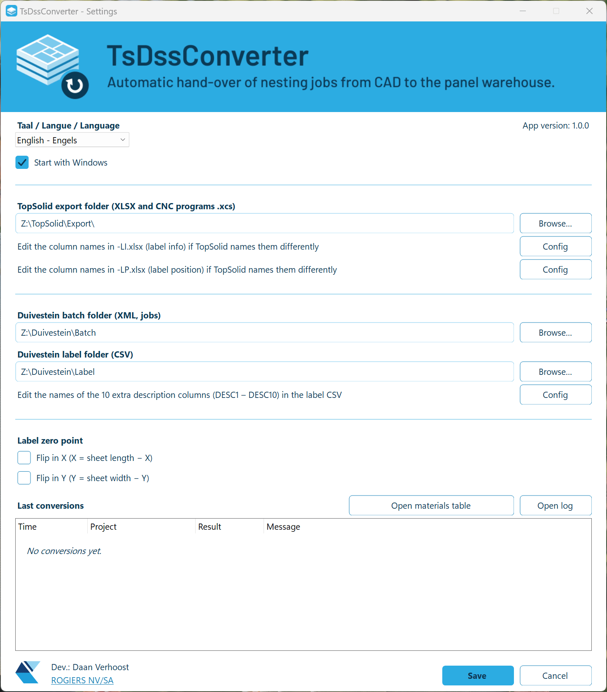
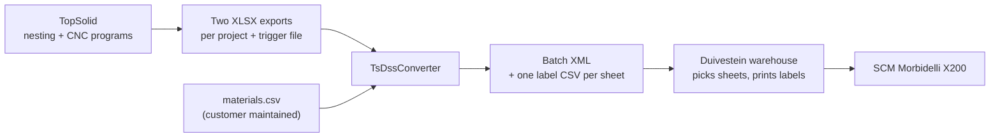

<h1 align="center"></h1>

**Automatic hand-over of nesting jobs from TopSolid to the Duivestein warehouse.**

TsDssConverter is a small Windows tray application that watches a folder for TopSolid nesting exports and
converts them, without any manual work, into a job that the Duivestein automatic warehouse understands.

> **Status: under development.** The conversion engine, its input checks, a command line tool, the tray application
> and the automatic folder watching are finished and tested (stages 1 to 4 of 5), and the delivery file for version
> 1.0.0 exists (stage 5). The test at the customer and with the real machines is still to come.
> See [Status and roadmap](#status-and-roadmap).

---

## What it looks like

The program lives in the Windows tray, next to the clock (possibly under the `^` arrow), and works silently in the
background. Double-click the icon to open the settings window.

<p align="center">
  
</p>

The settings window (here in English; the whole interface is also available in Dutch and French) holds the folders,
the label zero point and the list of the last conversions:

<p align="center">
  
</p>

A short demo of the program in use:

<p align="center">
  
</p>

## Why this tool exists

At the customer, panels are nested and programmed in **TopSolid** (CAD/CAM) for an **SCM Morbidelli X200**
CNC machine. The boards are stored and handled by a **Duivestein automatic warehouse**, which:

1. picks each sheet and puts it on the label table,
2. prints and places the labels (the label layout is generated by Duivestein),
3. registers the CNC program on the SCM and pushes the sheet onto the machine.

The warehouse needs a *batch job* that describes which sheets to pick, which labels to print and where each
label goes. TopSolid does not produce that format. TsDssConverter is the missing link between the two systems.



**What it does not do:** it does not print labels, does not talk to the machine and does not talk to
TopSolid. It only reads and writes files.

## What it does

For every finished TopSolid project it:

- reads the two XLSX exports (label information and label positions) and joins them per part,
- translates the TopSolid material names to the warehouse material names,
- creates **one batch XML** with one plan per material and one entry per sheet (label file + CNC program),
- creates **one label CSV per sheet**, with a row per part: its position, rotation, dimensions, edge banding
  and other data that Duivestein can use in the label layout,
- puts the files in the folders that the warehouse reads.

Excel or Office is **not** needed on the PC.

### Example

The included sample project (22 parts) becomes:

- 1 batch XML with 2 plans (one per material), and
- 3 label files, one for each physical sheet.

An extract of the batch XML:

```xml
<Plan>
  <PlanName>001</PlanName>
  <Material>Melamine_18</Material>
  <XDimSize>2850</XDimSize>
  <YDimSize>2100</YDimSize>
  <Quantity>2</Quantity>
  <LabelFilenames>
    <LabelFilename>Z:\Duivestein\Label\DAAN_ROGIERS-P2026.09_001.csv</LabelFilename>
    <!-- ... one per sheet ... -->
  </LabelFilenames>
  <CNCFilenames>
    <CNCFilename>Z:\TopSolid\Export\CNC\DAAN_ROGIERS-P2026.09\Melamine_18#01.xcs</CNCFilename>
    <!-- ... same order as the label files ... -->
  </CNCFilenames>
</Plan>
```

The complete expected output is in [`samples/duivestein/`](samples/duivestein/).

## Built to be safe

A wrong job in an automatic warehouse means a wrong board on the machine, so the tool is strict:

- **It never guesses a material.** A material that is not in `materials.csv` stops the conversion with a
  clear message that names the material.
- **It never overwrites a job.** If a batch with the same name already exists in the warehouse folder,
  nothing is written.
- **Jobs cannot overwrite each other's CNC programs.** TopSolid writes the programs of all jobs in one folder and names them
  after the sheet only (`Melamine_18#01.xcs`), so a second job would overwrite the first. After the conversion the program
  files of a job are moved to their own folder, `CNC\<project>\`, and the batch XML points there. A program that is newer
  than the job's trigger file (a later export overwrote it) is refused with a clear message: export that job again.
- **The warehouse never sees half a job.** All label files are written first and the batch XML last; every
  file is written under a temporary name and renamed when complete.
- **Incomplete or inconsistent input is refused, not repaired.** Missing columns, parts that appear in only one
  of the two files, duplicate parts, unknown materials, sheets of one material with different sizes, unreadable
  dimensions, angles that are not a multiple of 90 and labels that lie outside their sheet are all errors.
  Nothing is written when there is an error.
- **Every problem is reported at once, in plain language,** with the name of the part or column concerned, so
  the export can be corrected in one go instead of one error at a time. The messages are in Dutch, French
  or English, as selected in the settings.
- **Warnings do not stop a job, but are reported:** a CNC program that is not (yet) in the export folder, a part
  number that occurs more than once in the batch, and a material thickness in `materials.csv` that differs from
  the one in the TopSolid export.
- **It does not depend on the PC's regional settings.** Belgian PCs use a comma as decimal separator; the tool
  reads and writes numbers in a fixed way so results are identical on every PC.

## How the automatic processing works

The program watches the TopSolid export folder. TopSolid writes the two data files (`-LI` and `-LP`) and the CNC
programs, and the trigger file (`-TR`) as the very last one. When the trigger file appears:

1. The program waits until the three files are complete and no longer in use (it checks every 2 seconds, and gives up
   with an error after 2 minutes).
2. It converts the project (one at a time) and writes the label files and the batch XML for the warehouse.
3. It moves the three files to `_Verwerkt\<date-time> <project>` in the export folder (`_Effectuee` / `_Converted` in French /
   English, the folder names follow the selected language), and the CNC programs of the job
   to `CNC\<project>\` (the batch XML points there). The export folder itself then only holds what is not converted yet.
4. If something is wrong with the files, they go to `_Fout\<date-time> <project>` (`_Erreur` / `_Error`) together with a `fout.txt` that
   explains in plain language (in the selected language) what to correct. Putting the files back in the export folder
   starts a new attempt.

Problems that are not the fault of the files, such as a network drive that is not connected yet, do **not** move
anything: the files wait and the program tries again by itself, and the user is told once. The program also scans the
folder every 30 seconds (in case a file event is missed), and the menu item *Nu scannen* scans at once.

## Status and roadmap

| Stage | Content | Status |
|---|---|---|
| 1 | **Core + command line tool**: read, join, map, write XML and CSVs; automated tests | **Done (first draft)** |
| 2 | **Validation**: all checks and warnings, one clear report, exit code for errors | **Done (first draft)** |
| 3 | **Tray application (shell)**: icon with four looks (normal, busy, error, paused), menu, settings window, `settings.json`, start with Windows, log files. No conversion yet | **Done (first draft)** |
| 4 | **Folder watching and processing**: trigger file, one conversion at a time, `_Verwerkt` / `_Fout` folders with a readable `fout.txt`, notifications, recovery when the network drive is gone | **Done (first draft)** |
| 5 | **Delivery**: one file `TsDssConverter.exe` (version 1.0.0, 52 MB, no .NET needed), install at the customer, physical test sheet | **File built, customer test next** |

**What is verified so far**

- 363 automated tests pass.
- Converting the sample TopSolid export gives exactly the expected files (compared byte for byte).
- Every error and warning listed above is covered by a test, including a wrong pair of files and several
  problems at once.
- The tray application starts, creates its files, refuses a second copy, and can be published as one
  self-contained `.exe` (about 52 MB, no .NET installation needed on the customer PC). The delivered exe was tried
  on a PC environment without .NET: the sample export became the expected batch and label files.
- The settings window (saving, cancelling, hiding instead of closing, the history list) and the
  "start with Windows" registry setting are covered by tests.
- The folder watching and processing is covered by tests with a fake clock (waiting for the trigger file, giving up
  after 2 minutes, locked files, files that arrive late, a network drive that disappears and comes back, a problem
  that is reported only once, never converting twice). It was also tried with the real program: the sample was
  dropped in a folder while the program was running and became the expected batch and label files.
- Every text of the interface exists in Dutch, French and English: a test checks all of them, so a missing
  translation cannot slip in.
- A renamed column in the TopSolid export can be followed by editing a text file (see *Column names* below): this
  is covered by tests, including the whole processing of a project whose header was renamed, and a column file with
  a typing mistake.

**What is *not* verified yet**

- The expected files were derived from the agreed rules and have **not yet been confirmed by Duivestein**
  with a test import.
- Nothing has been tested with the customer's own TopSolid export or on the machine.
- The label position and rotation still have to be checked with a physical test sheet.

## Decisions taken so far

- **One folder for everything:** the program is installed in `C:\TsDssConverter\`. The exe, `settings.json`,
  `materials.csv`, the three column files (`columns-li.txt`, `columns-lp.txt`, `columns-label.txt`) and the log files all live there.
  Removing the program means deleting that folder.
- **TopSolid may rename a column without breaking the converter:** the header names that the program looks for are
  in two small text files that the customer can edit (buttons *Config* in the settings window). The order of the
  columns in the Excel files never matters, because columns are found by name.
- **Three languages:** the whole interface (window, tray menu, notifications and error messages) is available
  in Dutch, French and English. Dutch is the default. The language is chosen with a drop-down at the top of the
  settings window and takes effect when the settings are saved. The files for the warehouse are not translated.
- **A Windows 11 look:** the settings window uses rounded buttons, check boxes and text boxes and the Windows 11 font,
  in the colours of the application icon. Only the look changed; the behaviour is the same as with the standard controls.
- **Quiet operation:** the program lives in the Windows tray. There are no pop-ups on success; on an error there
  is one notification and the icon turns red until the next success or until the settings window is opened.
  While the program is paused, a pause symbol appears in the bottom right of the tray icon (like OneDrive).
- The TopSolid file with the suffix `-TR` is the **last** file that TopSolid writes. When it appears, the
  other export files and the CNC programs are complete.
- CNC programs have the extension `.xcs`.
- The CNC paths in the batch XML use the drive letter of the shared folder (for example `Z:`).
- After the conversion the CNC programs of a job are moved to `Z:\TopSolid\Export\CNC\<project>\` (decided by Daan, so that
  jobs with the same material and sheet number never overwrite each other's programs).
- The TopSolid material name is the master name; the same names are used in the warehouse.
- Duivestein checks that the sheet sizes in the batch match their stock.

## Still to be confirmed by others

| From | Question |
|---|---|
| TopSolid | Confirm the naming and folder of the CNC program per sheet. The program assumes `{sheet name}.xcs` in the export folder (for example `Melamine_18#01.xcs`), which is how all the exports we have look. Also: could the project name be part of that file name? Then two jobs could never collide, even before conversion |
| TopSolid | The sheet thickness column in the export is always 18; fix in the export (the tool takes the thickness from `materials.csv`) |
| Duivestein | Restrictions on batch name (length, characters) and what happens when a batch is sent twice |
| Duivestein | Character encoding for accented characters in the label files (UTF-8 is used for now) |
| Physical test | Which point of the label the position refers to, the rotation direction, and whether the zero-point settings change the rotation |

## Getting started (for developers)

Requirements: the [.NET 10 SDK](https://dotnet.microsoft.com/download) on Windows. The finished tray application
will be delivered as one self-contained `.exe`, so the customer PC needs no installation of .NET.

```
# Run all automated tests
dotnet test

# Convert the sample project (output goes to C:\Temp\out)
dotnet run --project src/TsDssConverter.Cli -- samples/topsolid/DAAN_ROGIERS-P2026.09-LI.xlsx samples/topsolid/DAAN_ROGIERS-P2026.09-LP.xlsx samples/materials.sample.csv C:\Temp\out
```

Options for the command line tool:

| Option | Meaning |
|---|---|
| `--flipx` | Label zero point at the other side in X (X = sheet length − X) |
| `--flipy` | Label zero point at the other side in Y (Y = sheet width − Y) |
| `--export-path <path>` | TopSolid export folder; its CNC programs are **moved** to `<path>\CNC\<project>\` (default `Z:\TopSolid\Export\`) |
| `--lang <nl\|fr\|en>` | Language of the messages (default `nl`) |

Exit code: `0` = OK, `1` = a problem in the input (message in Dutch), `2` = unexpected error.

### Trying out the tray application

```
dotnet run --project src/TsDssConverter.Tray -- --demo --show --data C:\Temp\TsDssData
```

`--data <folder>` keeps all files in another folder than `C:\TsDssConverter`, so a test never touches a real
installation. `--demo` adds three menu items to try out the icon looks "OK", "busy" and "error" and the list of
conversions; the "paused" look is switched on with the menu item *Pauzeren*. `--show` opens the settings window
right away. The icon appears next to the clock (possibly under the `^` arrow); double-click it for the
settings window. The window adapts to the screen scaling (100%, 125%, 150%, ...) and opens at the height of its
content, so the list of conversions is visible at once.

To build the delivery file for the customer PC, double-click or run `publish.cmd` in the project folder. It runs all
the tests first, and only if they pass it makes `dist\v1.0.0\TsDssConverter.exe` (the number is the `<Version>` in
`src/TsDssConverter.Tray/TsDssConverter.Tray.csproj`) and shows its size, version and SHA-256 checksum.
Use `publish.cmd -SkipTests` to skip the tests.

### Installing at the customer

The delivery is **one file**, `TsDssConverter.exe` (about 52 MB). It contains everything, so no .NET installation is
needed. It runs on 64-bit Windows 10 and 11. There is no installer: the program keeps all its files in one folder and
uninstalling is deleting that folder.

1. Create the folder `C:\TsDssConverter` and copy `TsDssConverter.exe` into it. On the first start the program writes the
   default `settings.json`, `materials.csv`, `columns-li.txt`, `columns-lp.txt` and `columns-label.txt` there (they are
   built into the exe, from the folder `defaults` of the project, so it stays one file). An existing file is never replaced.
   To change what a new installation starts with, edit the files in `defaults` and run `publish.cmd` again. (The SHA-256 checksum that
   `publish.cmd` prints can be compared with `certutil -hashfile TsDssConverter.exe SHA256` to check the copy.)
2. Start it by double-clicking. The exe is not code-signed, so Windows SmartScreen may say "Windows protected your
   PC": choose *More info* and *Run anyway*. If the file came by download or e-mail, first right-click it, choose
   *Properties* and tick *Unblock*. The very first start can take a few seconds (Windows scans the new file); later
   starts take about one second.
3. The icon appears in the tray (next to the clock, possibly under the `^` arrow). Double-click it to open the settings.
   Check the three folders (TopSolid export, Duivestein batch, Duivestein label), choose the language, tick *Start met
   Windows* if the program must start with the PC, and press *Opslaan*.
4. Press **Open materiaaltabel** and fill in every TopSolid material of the customer
   (`TopSolidMaterial;DssMaterial;Thickness;Grain`, see *Material mapping*). A material that is missing stops the
   conversion of a project, by design.
5. If TopSolid names a header differently than the sample export, adjust it with the **Config** buttons.
6. Test with a real export. The list in the settings window shows the result of every conversion, and the button
   **Open logmap** opens the log files. Files that could not be converted are in `_Fout` (`_Erreur` / `_Error` in French /
   English) in the export folder, together with a `fout.txt`.

**Updating** to a new version: exit the program (tray menu, *Afsluiten*), replace `TsDssConverter.exe` by the new one
and start it again. `settings.json`, `materials.csv`, the three column files and the logs are not touched (so a new version never
overwrites the customer's own materials list).
**Uninstalling**: exit the program, untick *Start met Windows*, and delete `C:\TsDssConverter`.

The folder `C:\TsDssConverter` is shared by all Windows users of the PC: if more than one user works on it, give them
write permission on the folder.

### Material mapping

`materials.csv` translates TopSolid material names to warehouse materials and gives the real thickness and grain
direction. It is a semicolon-separated file that opens directly in Belgian Excel:

```
TopSolidMaterial;DssMaterial;Thickness;Grain
Melamine_18;Melamine_18;18;0
Melamine_08;Melamine_08;8;0
```

Grain: `0` = none, `1` = along the length, `2` = across. See [`samples/materials.sample.csv`](samples/materials.sample.csv).

### Column names

The program finds every column of the TopSolid files by its **header name**, never by position, so the order of the
columns does not matter. If TopSolid ever names a header differently, the converter would stop with a message such as
*Column 'Projet' / 'Test' is missing in the LI file*. To follow such a change without a new version of the program, the names are
in text files in `C:\TsDssConverter\`, which open in Notepad from the buttons **Config** in the settings window
(the first two are under the TopSolid export folder: the first for the LI file, the second for the LP file; the third,
for the label CSV, is described below):

```
# columns-li.txt (the explanation at the top of the file is left out here)
Project      = Projet | Test
SheetName    = Nom_panneau | Naam_Plaat
Description  = Description | Omschrijving
```

- Left of the `=` is what the program needs (do not change it), right of it is the header in the Excel file.
- Several names can be given, separated by `|`: the first one that is in the file is used. This keeps old and new
  exports working at the same time.
- A field that is left out keeps its built-in name, a deleted file is made again with the default names, and the
  files are read again for every project, so no restart is needed after a change.
- A mistake in the column file (an unknown field, a line without `=`) does not move the TopSolid files to the error
  folder: they wait and the conversion is tried again as soon as the file is correct. The message names the file and
  the line.
- If a column is really missing, the error names all missing columns at once and adds a tip about this file.
- The fixed columns of the LI file are required, including `CAM_2` and `CAM_3` (the two special columns; `CAM3` comes right
  after `CAM2` in the label CSV). Only the ten `DESC` columns may be missing without an error: the label CSV then simply
  has empty `DESC` columns. The built-in names are the headers of the newest TopSolid export (`Projet`, `Nom_panneau`,
  `Description`, `Dimensions`, `Matériau`, ...); the older Dutch names (`Test`, `Naam_Plaat`, `Omschrijving`, ...) are
  accepted as a second name.

**Ten extra description fields for the label.** The LI and the LP file may contain the optional columns `DESC1` to
`DESC10` (their header names are in `columns-li.txt` and `columns-lp.txt` like all others). They become the **last ten
columns of every label CSV**, after the 23 fixed columns, for use in the label template in Duivestein. If both files
have a value, the one from the LI file is used; if that is empty, the one from the LP file. The columns are always
in the CSV, empty when the export has no such column. Their names in the CSV (`DESC1` to `DESC10` by default) are in a
third file, `columns-label.txt`, that opens from the **Config** button under the Duivestein label folder:

```
# columns-label.txt (the explanation at the top of the file is left out here)
Desc1 = DESC1
Desc2 = KLANT
```

A name may only contain letters (no accents), digits, underscore and dash, and must not be the name of another column
of the label CSV. The names of the 23 fixed columns cannot be changed, because Duivestein reads them by name.

Above the list of conversions there are two more buttons: **Open materiaaltabel** (opens `materials.csv`) and
**Open logmap** (opens the folder with the log files). The app version is shown at the top right of the window.

## Project layout

```
samples/
  topsolid/       Example TopSolid export (input)
  duivestein/     Expected output for the example + the format description from Duivestein
  materials.sample.csv
src/
  TsDssConverter.Core/   All conversion logic (no Windows or user interface dependencies)
  TsDssConverter.Cli/    Command line tool for manual testing
  TsDssConverter.Tray/   The tray application (Windows Forms): icon, menu, settings window
tests/
  TsDssConverter.Tests/  Automated tests, using the files in samples/
media/                   Application icon, banner and the colour theme used by the whole project
docs/                    Background documentation
publish.cmd              Builds the delivery file (runs the tests, then makes dist\v<version>\TsDssConverter.exe)
```

## Technology

C# on .NET 10, [ClosedXML](https://github.com/ClosedXML/ClosedXML) to read XLSX files (no Excel needed),
xUnit for the tests. The tray application uses Windows Forms.

## Credits

Developed by Daan Verhoost for [ROGIERS NV/SA](https://www.rogiers.be/).
