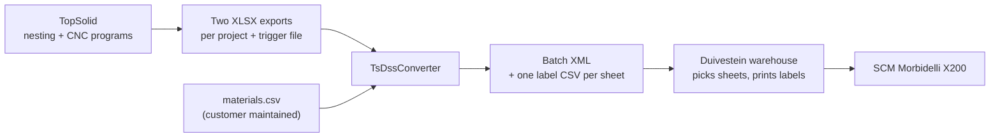

<h1 align="center"></h1>

**Automatic hand-over of nesting jobs from TopSolid to the Duivestein warehouse.**

TsDssConverter is a small Windows tray application that watches a folder for TopSolid nesting exports and
converts them, without any manual work, into a job that the Duivestein automatic warehouse understands.

> **Status: under development.** The conversion engine, its input checks, a command line tool and the shell of
> the tray application (icon, menu, settings window) are finished and tested (stages 1 to 3 of 5). The automatic
> folder watching and the installation at the customer are still to be built.
> See [Status and roadmap](#status-and-roadmap).

---

## Why this tool exists

At the customer, panels are nested and programmed in **TopSolid** (CAD/CAM) for an **SCM Morbidelli X200**
CNC machine. The boards are stored and handled by a **Duivestein automatic warehouse**, which:

1. picks each sheet and puts it on the label table,
2. prints and places the labels (the label layout is generated by Duivestein),
3. registers the CNC program on the SCM and pushes the sheet onto the machine.

The warehouse needs a *batch job* that describes which sheets to pick, which labels to print and where each
label goes. TopSolid does not produce that format. TsDssConverter is the missing link between the two systems.



**What it does not do:** it does not print labels, does not talk to the machine and does not talk to
TopSolid. It only reads and writes files.

## What it does

For every finished TopSolid project it:

- reads the two XLSX exports (label information and label positions) and joins them per part,
- translates the TopSolid material names to the warehouse material names,
- creates **one batch XML** with one plan per material and one entry per sheet (label file + CNC program),
- creates **one label CSV per sheet**, with a row per part: its position, rotation, dimensions, edge banding
  and other data that Duivestein can use in the label layout,
- puts the files in the folders that the warehouse reads.

Excel or Office is **not** needed on the PC.

### Example

The included sample project (63 parts) becomes:

- 1 batch XML with 5 plans (one per material), and
- 11 label files, one for each physical sheet.

An extract of the batch XML:

```xml
<Plan>
  <PlanName>002</PlanName>
  <Material>White_18</Material>
  <XDimSize>3050</XDimSize>
  <YDimSize>1300</YDimSize>
  <Quantity>5</Quantity>
  <LabelFilenames>
    <LabelFilename>Verschuren-P-20_002.csv</LabelFilename>
    <!-- ... one per sheet ... -->
  </LabelFilenames>
  <CNCFilenames>
    <CNCFilename>Z:\TopSolid\Export\Verschuren-P-20_White_18_01.xcs</CNCFilename>
    <!-- ... same order as the label files ... -->
  </CNCFilenames>
</Plan>
```

The complete expected output is in [`samples/duivestein/`](samples/duivestein/).

## Built to be safe

A wrong job in an automatic warehouse means a wrong board on the machine, so the tool is strict:

- **It never guesses a material.** A material that is not in `materials.csv` stops the conversion with a
  clear message that names the material.
- **It never overwrites a job.** If a batch with the same name already exists in the warehouse folder,
  nothing is written.
- **The warehouse never sees half a job.** All label files are written first and the batch XML last; every
  file is written under a temporary name and renamed when complete.
- **Incomplete or inconsistent input is refused, not repaired.** Missing columns, parts that appear in only one
  of the two files, duplicate parts, unknown materials, sheets of one material with different sizes, unreadable
  dimensions, angles that are not a multiple of 90 and labels that lie outside their sheet are all errors.
  Nothing is written when there is an error.
- **Every problem is reported at once, in plain language,** with the name of the part or column concerned, so
  the export can be corrected in one go instead of one error at a time. The messages are in Dutch, French
  or English, as selected in the settings.
- **Warnings do not stop a job, but are reported:** a CNC program that is not (yet) in the export folder, a part
  number that occurs more than once in the batch, and a material thickness in `materials.csv` that differs from
  the one in the TopSolid export.
- **It does not depend on the PC's regional settings.** Belgian PCs use a comma as decimal separator; the tool
  reads and writes numbers in a fixed way so results are identical on every PC.

## Status and roadmap

| Stage | Content | Status |
|---|---|---|
| 1 | **Core + command line tool**: read, join, map, write XML and CSVs; automated tests | **Done (first draft)** |
| 2 | **Validation**: all checks and warnings, one clear report, exit code for errors | **Done (first draft)** |
| 3 | **Tray application (shell)**: icon with four looks (normal, busy, error, paused), menu, settings window, `settings.json`, start with Windows, log files. No conversion yet | **Done (first draft)** |
| 4 | **Folder watching and processing**: trigger file, queue, `_Verwerkt` / `_Fout` folders, notifications | Next |
| 5 | **Delivery**: single-file installation, install at the customer, physical test sheet | Planned |

**What is verified so far**

- 256 automated tests pass.
- Converting the sample TopSolid export gives exactly the expected files (compared byte for byte).
- Every error and warning listed above is covered by a test, including a wrong pair of files and several
  problems at once.
- The tray application starts, creates its files, refuses a second copy, and can be published as one
  self-contained `.exe` (about 126 MB, no .NET installation needed on the customer PC).
- The settings window (saving, cancelling, hiding instead of closing, the history list) and the
  "start with Windows" registry setting are covered by tests.
- Every text of the interface exists in Dutch, French and English: a test checks all of them, so a missing
  translation cannot slip in.

**What is *not* verified yet**

- The expected files were derived from the agreed rules and have **not yet been confirmed by Duivestein**
  with a test import.
- Nothing has been tested with the customer's own TopSolid export or on the machine.
- The label position and rotation still have to be checked with a physical test sheet.

## Decisions taken so far

- **One folder for everything:** the program is installed in `C:\TsDssConverter\`. The exe, `settings.json`,
  `materials.csv` and the log files all live there. Removing the program means deleting that folder.
- **Three languages:** the whole interface (window, tray menu, notifications and error messages) is available
  in Dutch, French and English. Dutch is the default. The language is chosen with a drop-down at the top of the
  settings window and takes effect when the settings are saved. The files for the warehouse are not translated.
- **Quiet operation:** the program lives in the Windows tray. There are no pop-ups on success; on an error there
  is one notification and the icon turns red until the next success or until the settings window is opened.
  While the program is paused, a pause symbol appears in the bottom right of the tray icon (like OneDrive).
- The TopSolid file with the suffix `-TR` is the **last** file that TopSolid writes. When it appears, the
  other export files and the CNC programs are complete.
- CNC programs have the extension `.xcs`.
- The CNC paths in the batch XML use the drive letter of the shared folder (for example `Z:`).
- The TopSolid material name is the master name; the same names are used in the warehouse.
- Duivestein checks that the sheet sizes in the batch match their stock.

## Still to be confirmed by others

| From | Question |
|---|---|
| TopSolid | Exact naming and folder of the CNC program per sheet (the current naming is provisional) |
| TopSolid | The sheet thickness column in the export is always 18; fix in the export (the tool takes the thickness from `materials.csv`) |
| Duivestein | Restrictions on batch name (length, characters) and what happens when a batch is sent twice |
| Duivestein | Character encoding for accented characters in the label files (UTF-8 is used for now) |
| Physical test | Which point of the label the position refers to, the rotation direction, and whether the zero-point settings change the rotation |

## Getting started (for developers)

Requirements: the [.NET 10 SDK](https://dotnet.microsoft.com/download) on Windows. The finished tray application
will be delivered as one self-contained `.exe`, so the customer PC needs no installation of .NET.

```
# Run all automated tests
dotnet test

# Convert the sample project (output goes to C:\Temp\out)
dotnet run --project src/TsDssConverter.Cli -- samples/topsolid/Verschuren-P-20-LI.xlsx samples/topsolid/Verschuren-P-20-LP.xlsx samples/materials.sample.csv C:\Temp\out
```

Options for the command line tool:

| Option | Meaning |
|---|---|
| `--flipx` | Label zero point at the other side in X (X = sheet length − X) |
| `--flipy` | Label zero point at the other side in Y (Y = sheet width − Y) |
| `--export-path <path>` | TopSolid export folder as used in the CNC paths (default `Z:\TopSolid\Export\`) |
| `--lang <nl\|fr\|en>` | Language of the messages (default `nl`) |

Exit code: `0` = OK, `1` = a problem in the input (message in Dutch), `2` = unexpected error.

### Trying out the tray application

```
dotnet run --project src/TsDssConverter.Tray -- --demo --show --data C:\Temp\TsDssData
```

`--data <folder>` keeps all files in another folder than `C:\TsDssConverter`, so a test never touches a real
installation. `--demo` adds three menu items to try out the icon looks "OK", "busy" and "error" and the list of
conversions; the "paused" look is switched on with the menu item *Pauzeren*. `--show` opens the settings window
right away. The icon appears next to the clock (possibly under the `^` arrow); double-click it for the
settings window. The window adapts to the screen scaling (100%, 125%, 150%, ...) and opens at the height of its
content, so the list of conversions is visible at once.

To build the single-file version for the customer PC:

```
dotnet publish src/TsDssConverter.Tray -c Release -r win-x64 --self-contained true -p:PublishSingleFile=true
```

### Material mapping

`materials.csv` translates TopSolid material names to warehouse materials and gives the real thickness and grain
direction. It is a semicolon-separated file that opens directly in Belgian Excel:

```
TopSolidMaterial;DssMaterial;Thickness;Grain
White_18;White_18;18;0
White_9;White_9;9;0
```

Grain: `0` = none, `1` = along the length, `2` = across. See [`samples/materials.sample.csv`](samples/materials.sample.csv).

## Project layout

```
samples/
  topsolid/       Example TopSolid export (input)
  duivestein/     Expected output for the example + the format description from Duivestein
  materials.sample.csv
src/
  TsDssConverter.Core/   All conversion logic (no Windows or user interface dependencies)
  TsDssConverter.Cli/    Command line tool for manual testing
  TsDssConverter.Tray/   The tray application (Windows Forms): icon, menu, settings window
tests/
  TsDssConverter.Tests/  Automated tests, using the files in samples/
media/                   Application icon, banner and the colour theme used by the whole project
docs/                    Background documentation
CLAUDE.md                Detailed technical specification and working notes
```

The complete technical specification (input columns, output format, validation rules, tray behaviour) is in
[`CLAUDE.md`](CLAUDE.md).

## Technology

C# on .NET 10, [ClosedXML](https://github.com/ClosedXML/ClosedXML) to read XLSX files (no Excel needed),
xUnit for the tests. The tray application uses Windows Forms.

## Credits

Developed by Daan Verhoost for [ROGIERS NV/SA](https://www.rogiers.be/).
